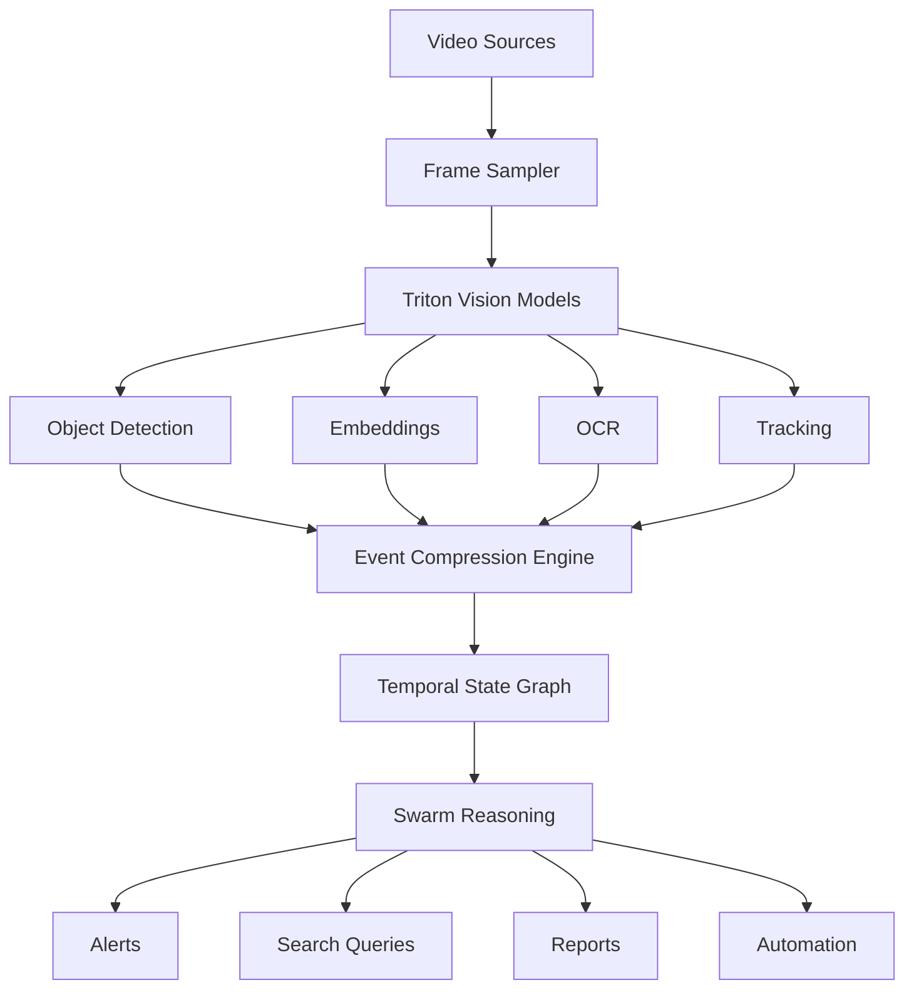

* video **surveillance**
* video **creation / synthesis**
* **compression-first architecture**
* integration with **Triton + Swarm**
* use of **cell → dot → small → medium → large**
* interaction with **email, EDGAR, and other data sources**

You can place this in a repo such as:

```text
video-swarm
video-intelligence
video-unity
```

---

# Video Swarm Intelligence

A **compression-first video intelligence and creation platform** built on the Calculus Swarm architecture.

The system performs both:

* **Video Surveillance / Monitoring**
* **Video Creation / Synthesis**

Instead of sending raw video to large multimodal models, the platform converts video into **compressed semantic events**, enabling scalable reasoning, search, and automation.

```text
video
→ perception
→ compression
→ semantic events
→ swarm reasoning
```

This dramatically reduces compute cost while improving accuracy and explainability.

---

# System Architecture



The system separates **perception, memory, and reasoning**.

---

# Related Repositories

This platform works with multiple repositories.

## Triton

```
/workspaces/Triton
```

Responsibilities:

* model runtime
* GPU inference
* ternary models
* perception models

Models deployed:

| Model          | Purpose                  |
| -------------- | ------------------------ |
| cell           | classification / routing |
| dot            | normalization            |
| ultra_micro    | packet compression       |
| micro          | cheap worker             |
| ternary_tiny   | helper tier              |
| ternary_small  | default worker           |
| ternary_medium | judge / reasoning        |
| ternary_large  | premium synthesis        |

Vision models:

* YOLO / RT-DETR
* CLIP / SigLIP
* OCR

---

## super-duper-spork

Swarm orchestration layer.

Handles:

* routing
* governance
* cascade selection
* escalation logic

Pipeline:

```text
cell → dot → small → medium → large → cloud
```

Modules:

* `cell_classifier.py`
* `dot_normalizer.py`
* `dual_layer.py`
* `context_management.py`
* `ai_portal_client.py`

---

## Video Swarm (this repository)

Responsibilities:

* video ingestion
* perception pipelines
* event compression
* temporal reasoning
* video search
* video generation

---

## Quantum-Protocol

Financial trading platform.

AI is used only for:

* alert explanation
* incident summaries
* audit commentary

Never for:

* live trading decisions
* kill switch logic

---

## DFIP

Financial infrastructure platform.

Uses swarm models for:

* compliance interpretation
* support triage
* document reasoning

---

## Constitutional-Tender Web Terminal

User interface.

Uses:

```
dot → small → medium
```

for:

* product assistant
* knowledge search
* explanations
* user workflows

---

# Video Surveillance

The system monitors video streams to detect events.

Sources:

* CCTV
* drones
* body cameras
* industrial cameras
* uploaded video

Pipeline:

```text
video
→ frame sampling
→ detection models
→ event compression
→ reasoning
```

---

# Example Surveillance Output

Example event:

```
10:03:12 — person entered restricted zone
10:03:15 — helmet missing detected
10:03:19 — forklift within unsafe distance
10:03:30 — person exited zone
```

Generated alert:

```
ALERT
Worker entered restricted area without helmet.
Forklift was within unsafe proximity.
Duration: 18 seconds.
```

---

# Video Search

Video is converted into searchable events.

Example query:

```
Show all times a forklift approached a person without safety gear.
```

Pipeline:

```
query
→ event graph
→ evidence clips
→ reasoning
```

Results include:

* timeline
* clip
* explanation

---

# Video Creation

The platform can also **generate video content**.

Sources for generation:

* prompts
* event timelines
* email threads
* EDGAR filings
* incident reports

Example generation:

```
Create a training video explaining a safety violation scenario.
```

Pipeline:

```text
event narrative
→ scene planner
→ generation model
→ rendered video
```

Possible outputs:

* training simulations
* incident recreations
* animated explanations
* compliance tutorials

---

# Compression Model

Raw video is compressed into **semantic events**.

Instead of:

```
300 frames
```

The system stores:

```
entity
state
transition
evidence
```

Example record:

```json
{
 "entity": "person_7",
 "event": "entered_zone",
 "zone": "loading_dock",
 "start_time": "10:03:12",
 "end_time": "10:03:30",
 "evidence": {
  "clip": "camera1/10-03-10_10-03-32.mp4",
  "frames": [1012,1034,1088]
 }
}
```

---

# Storage Model

Four key tables.

## Entities

```
person_7
forklift_2
truck_4
zone_b
door_1
```

## Events

```
entered_zone
exited_zone
state_change
rule_violation
interaction
```

## States

```
present
moving
helmet_missing
door_open
badge_visible
```

## Evidence

```
video clip
keyframes
embeddings
OCR text
```

---

# Performance

Example deployment on **NVIDIA L4 GPU**.

| Model  | Throughput |
| ------ | ---------- |
| tiny   | ~150 tok/s |
| small  | ~90 tok/s  |
| medium | ~45 tok/s  |
| large  | ~30 tok/s  |

Vision models can process:

```
100+ frames/sec
```

This allows multiple simultaneous video streams.

---

# Example Pipeline

```
camera stream
→ Triton YOLO
→ CLIP embeddings
→ event compression
→ swarm reasoning
→ alert / report
```

---

# Use Cases

## Security

* intrusion detection
* suspicious behavior
* unauthorized access

## Safety

* missing PPE
* hazardous proximity
* machine safety violations

## Operations

* queue monitoring
* asset tracking
* warehouse logistics

## Video Search

* semantic clip search
* incident reconstruction
* compliance audits

## Video Creation

* training videos
* scenario simulations
* instructional media
* event reconstructions

---

# Key Design Principle

The system does **not analyze raw video directly**.

Instead it converts video into:

```
compressed semantic events
```

Then performs reasoning on those events.

This enables:

* massive cost reduction
* scalable analysis
* explainable results

---

