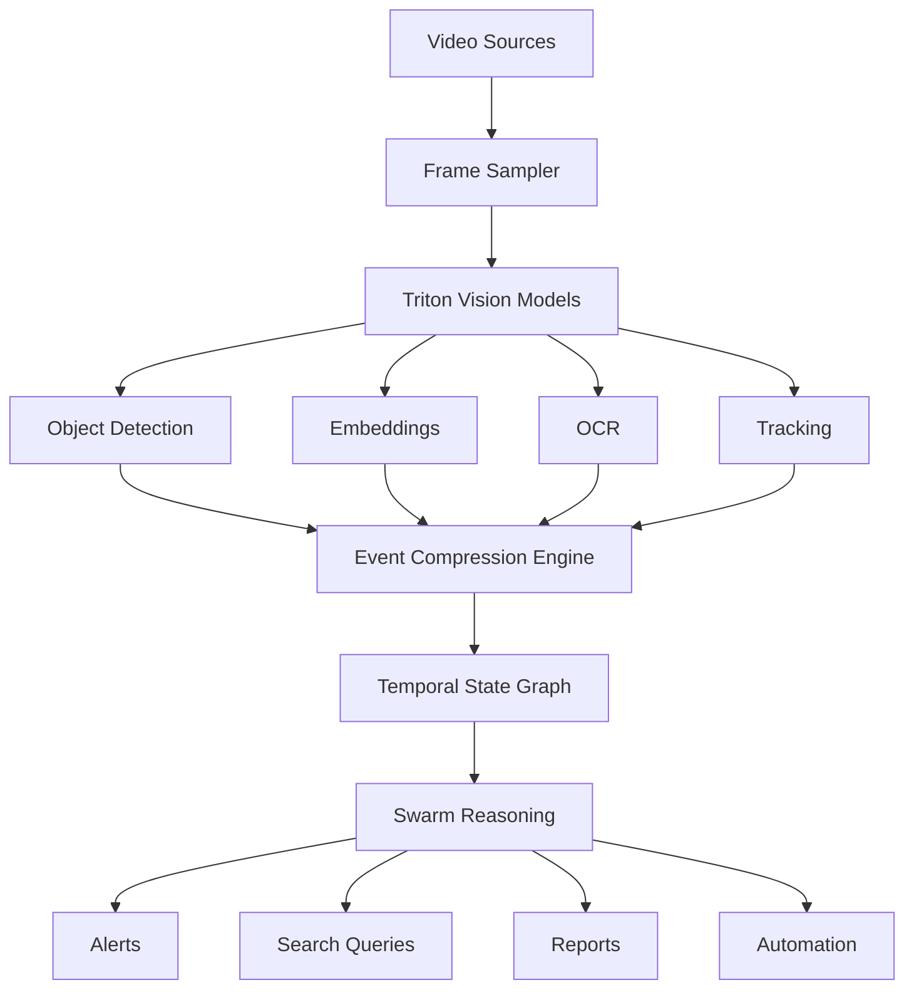

# Worldview

**Compression-first video intelligence and creation platform** built on the Calculus Swarm architecture.

Instead of sending raw video to large multimodal models, Worldview converts video into **compressed semantic events**, enabling scalable reasoning, search, and automation at a fraction of the cost.

```text
video → perception → compression → semantic events → swarm reasoning
```

> See [ROADMAP.md](ROADMAP.md) for planned milestones and future direction.

---

## Table of Contents

1. [Overview](#overview)
2. [System Architecture](#system-architecture)
3. [Core Capabilities](#core-capabilities)
   - [Video Surveillance](#video-surveillance)
   - [Video Search](#video-search)
   - [Video Creation](#video-creation)
4. [Compression Model](#compression-model)
5. [Storage Model](#storage-model)
6. [Performance](#performance)
7. [Use Cases](#use-cases)
8. [Related Repositories](#related-repositories)
9. [Design Principles](#design-principles)

---

## Overview

Worldview performs two primary functions:

| Function | Description |
| -------- | ----------- |
| **Surveillance / Monitoring** | Detect events, violations, and anomalies in live or recorded video |
| **Video Creation / Synthesis** | Generate training videos, incident recreations, and scenario simulations |

The core insight is that video contains massive redundancy. By compressing video into a structured **event graph** with sparse keyframes, the system stores and reasons over semantic meaning rather than raw pixels — achieving **100×–1000× storage reduction** and enabling explainable AI results.

---

## System Architecture



The system cleanly separates **perception**, **memory**, and **reasoning** into distinct layers.

---

## Core Capabilities

### Video Surveillance

Monitors live or recorded streams to detect and classify events.

**Supported sources:** CCTV, drones, body cameras, industrial cameras, uploaded video

**Pipeline:**
```text
video → frame sampling → detection models → event compression → reasoning
```

**Example output:**
```
10:03:12 — person entered restricted zone
10:03:15 — helmet missing detected
10:03:19 — forklift within unsafe distance
10:03:30 — person exited zone

ALERT: Worker entered restricted area without helmet.
       Forklift was within unsafe proximity. Duration: 18 seconds.
```

---

### Video Search

Converts video into a queryable event graph for semantic search.

**Example query:**
```
Show all times a forklift approached a person without safety gear.
```

**Pipeline:**
```text
query → event graph → evidence clips → reasoning
```

Results include a timeline, evidence clip, and plain-language explanation.

---

### Video Creation

Generates video content from structured event narratives.

**Input sources:** prompts, event timelines, email threads, EDGAR filings, incident reports

**Pipeline:**
```text
event narrative → scene planner → generation model → rendered video
```

**Possible outputs:** training simulations, incident recreations, animated explanations, compliance tutorials

**Generation approach — Event-Structured Video:**

Rather than generating every frame independently, the system stores sparse keyframes and an event graph, then uses L4 GPUs to reconstruct intermediate frames:

```text
Event Timeline → Keyframe Anchors → Motion Vector Prediction
             → Frame Interpolation → Full Video
```

This leverages the same compression-first philosophy as the rest of the platform:
**compress the representation first, compute the missing structure second.**

The L4 GPU handles optical flow estimation, diffusion interpolation, and motion field reconstruction. Generation can also be parallelized across swarm nodes by splitting the timeline into segments.

---

## Compression Model

Raw video is compressed into structured **semantic events** rather than storing frames.

**Instead of:** 300 raw frames  
**The system stores:**
```
entity · state · transition · evidence
```

**Example event record:**
```json
{
  "entity": "person_7",
  "event": "entered_zone",
  "zone": "loading_dock",
  "start_time": "10:03:12",
  "end_time": "10:03:30",
  "evidence": {
    "clip": "camera1/10-03-10_10-03-32.mp4",
    "frames": [1012, 1034, 1088]
  }
}
```

**Compression ratio target:** 100×–1000× depending on motion complexity.

---

## Storage Model

Four core tables underpin the event database.

| Table | Examples |
| ----- | -------- |
| **Entities** | `person_7`, `forklift_2`, `truck_4`, `zone_b`, `door_1` |
| **Events** | `entered_zone`, `exited_zone`, `state_change`, `rule_violation`, `interaction` |
| **States** | `present`, `moving`, `helmet_missing`, `door_open`, `badge_visible` |
| **Evidence** | video clip, keyframes, embeddings, OCR text |

---

## Performance

Example deployment on **NVIDIA L4 GPU**.

| Model  | Throughput |
| ------ | ---------- |
| tiny   | ~150 tok/s |
| small  | ~90 tok/s  |
| medium | ~45 tok/s  |
| large  | ~30 tok/s  |

Vision models process **100+ frames/sec**, supporting multiple simultaneous video streams.

**Example end-to-end pipeline:**
```text
camera stream → Triton YOLO → CLIP embeddings → event compression → swarm reasoning → alert / report
```

---

## Use Cases

| Domain | Applications |
| ------ | ------------ |
| **Security** | Intrusion detection, suspicious behavior, unauthorized access |
| **Safety** | Missing PPE detection, hazardous proximity, machine safety violations |
| **Operations** | Queue monitoring, asset tracking, warehouse logistics |
| **Video Search** | Semantic clip search, incident reconstruction, compliance audits |
| **Video Creation** | Training videos, scenario simulations, instructional media, event reconstructions |

---

## Related Repositories

| Repository | Role |
| ---------- | ---- |
| **Triton** | Model runtime, GPU inference, ternary models, and vision models (YOLO/RT-DETR, CLIP/SigLIP, OCR) |
| **super-duper-spork** | Swarm orchestration — routing, governance, cascade selection, escalation logic |
| **Quantum-Protocol** | Financial trading platform; AI used for alerts, summaries, and audit commentary only |
| **DFIP** | Financial infrastructure platform; swarm models for compliance, triage, and document reasoning |
| **Constitutional-Tender** | Web terminal UI using `dot → small → medium` pipeline for assistant and search features |

### Triton model tiers

| Model | Purpose |
| ----- | ------- |
| `cell` | classification / routing |
| `dot` | normalization |
| `ultra_micro` | packet compression |
| `micro` | cheap worker |
| `ternary_tiny` | helper tier |
| `ternary_small` | default worker |
| `ternary_medium` | judge / reasoning |
| `ternary_large` | premium synthesis |

### Swarm pipeline

```text
cell → dot → small → medium → large → cloud
```

---

## Design Principles

1. **Compression first.** The system never analyzes raw video directly. Video is always converted to compressed semantic events before any reasoning occurs.

2. **Separation of concerns.** Perception, memory, and reasoning are distinct layers with clean interfaces.

3. **Explainability.** Because reasoning runs on structured events rather than pixel arrays, every decision is traceable to a specific entity, state, and timestamp.

4. **Cost efficiency.** Ternary models and event compression reduce compute requirements by orders of magnitude compared to sending raw video to large multimodal models.

5. **Scalability.** The swarm architecture distributes both inference and video generation across GPU nodes, allowing the system to scale horizontally.
