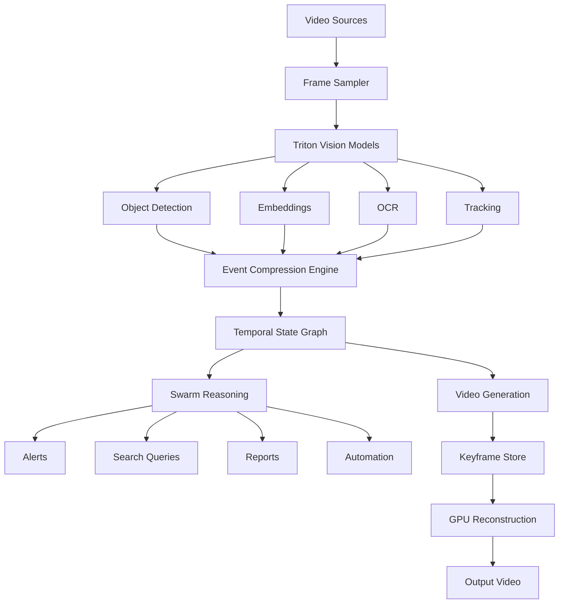

# Worldview — Video Swarm Intelligence Roadmap

A **compression-first video intelligence and creation platform** built on the Calculus Swarm architecture. Instead of sending raw video to large multimodal models, the platform converts video into **compressed semantic events**, enabling scalable reasoning, search, automation, and generation at a fraction of the compute cost.

**Core Principle**: The system does not analyze or generate raw video directly. It compresses video into semantic events, then reasons on — or reconstructs from — those events.

```text
video → perception → compression → semantic events → swarm reasoning / generation
```

---

## System Architecture



The system separates **perception, memory, reasoning, and generation** into distinct layers.

---

## Ecosystem Integration

| Repository | Role | Integration |
|------------|------|-------------|
| **Triton** | Model runtime, GPU inference, ternary models, perception models | Vision model hosting (YOLO, CLIP, OCR), inference server |
| **super-duper-spork** | Swarm orchestration, routing, governance | Task routing via cell → dot → small → medium → large → cloud cascade |
| **BUNNY** | Edge workers, encrypted comms, distributed compute | Distributed video generation workers, QUIC transport |
| **Quantum-Protocol** | Financial trading platform | Alert explanation, incident summaries (AI read-only) |
| **DFIP** | Financial infrastructure | Compliance interpretation, document reasoning |
| **Constitutional-Tender** | Web terminal UI | Product assistant, knowledge search via dot → small → medium |

### Triton Model Ladder

| Model | Purpose |
|-------|---------|
| cell | classification / routing |
| dot | normalization |
| ultra_micro | packet compression |
| micro | cheap worker |
| ternary_tiny | helper tier |
| ternary_small | default worker |
| ternary_medium | judge / reasoning |
| ternary_large | premium synthesis |

### Vision Models

- YOLO / RT-DETR (object detection)
- CLIP / SigLIP (embeddings)
- OCR (text extraction)

---

## Roadmap

### Phase 1: Event Compression Engine (Foundation)

Build the core compression layer that transforms raw video frames into structured semantic events.

**Data Model** — Four key tables:

| Table | Examples |
|-------|---------|
| Entities | `person_7`, `forklift_2`, `truck_4`, `zone_b`, `door_1` |
| Events | `entered_zone`, `exited_zone`, `state_change`, `rule_violation`, `interaction` |
| States | `present`, `moving`, `helmet_missing`, `door_open`, `badge_visible` |
| Evidence | video clip, keyframes, embeddings, OCR text |

**Event Record Format**:

```json
{
  "entity": "person_7",
  "event": "entered_zone",
  "zone": "loading_dock",
  "start_time": "10:03:12",
  "end_time": "10:03:30",
  "evidence": {
    "clip": "camera1/10-03-10_10-03-32.mp4",
    "frames": [1012, 1034, 1088]
  }
}
```

**Compression Pipeline**:

```text
raw frames → keyframe extraction → event graph construction → compressed timeline
```

Instead of storing 300 frames, the system stores entity + state + transition + evidence. Target compression ratio: **100x - 1000x** depending on motion complexity.

**Deliverables**: Compression library, storage schema, event format specification.

---

### Phase 2: Perception Pipeline (Triton Vision)

Integrate Triton-hosted vision models to extract structured perception data from video frames.

**Pipeline**:

```text
video → frame sampling → Triton vision models → structured perception output
```

**Components**:
- Frame sampler with adaptive rate control
- Object detection via YOLO / RT-DETR on Triton
- Embedding extraction via CLIP / SigLIP
- Text extraction via OCR
- Multi-object tracking across frames

**Performance Target**: 100+ frames/sec on NVIDIA L4 GPU, enabling multiple simultaneous video streams.

**Deliverables**: Perception service, Triton model configurations, frame sampler module.

---

### Phase 3: Video Surveillance & Monitoring

Build real-time video monitoring with automated event detection and alerting.

**Supported Sources**:
- CCTV cameras
- Drones
- Body cameras
- Industrial cameras
- Uploaded video files

**Pipeline**:

```text
video → frame sampling → detection models → event compression → reasoning → alerts
```

**Example Detection Output**:

```text
10:03:12 — person entered restricted zone
10:03:15 — helmet missing detected
10:03:19 — forklift within unsafe distance
10:03:30 — person exited zone
```

**Generated Alert**:

```text
ALERT
Worker entered restricted area without helmet.
Forklift was within unsafe proximity.
Duration: 18 seconds.
```

**Use Cases**:
- **Security**: intrusion detection, suspicious behavior, unauthorized access
- **Safety**: missing PPE, hazardous proximity, machine safety violations
- **Operations**: queue monitoring, asset tracking, warehouse logistics

**Deliverables**: Surveillance service, alert API, monitoring dashboard, example deployment.

---

### Phase 4: Video Search & Retrieval

Convert video archives into searchable semantic event databases.

**Pipeline**:

```text
query → temporal state graph → evidence clips → swarm reasoning → results
```

**Example Query**:

```text
Show all times a forklift approached a person without safety gear.
```

**Results Include**:
- Timeline of matching events
- Evidence video clips
- Natural language explanation of each match

**Use Cases**:
- Semantic clip search across large video archives
- Incident reconstruction from event timelines
- Compliance audit evidence gathering

**Deliverables**: Search API, query engine, evidence extraction service.

---

### Phase 5: Event-Structured Video Generation

Instead of generating full video frame-by-frame, represent video as structured events and reconstruct the missing frames using GPU inference. This applies the same compression-first philosophy as the ternary model work: **compress the representation first, compute the missing structure second**.

**Core Representation** — Video becomes a timeline of events:

```text
t0  scene_start
t1  camera_pan_left
t2  subject_turn
t3  subject_speaks
t4  scene_end
```

**Event Packet Format**:

```json
{
  "timestamp": 1.23,
  "event_type": "camera_motion",
  "parameters": {
    "direction": "left",
    "velocity": 0.3
  }
}
```

**Compression**: Instead of 30 fps video, store keyframes + event graph. Everything between keyframes is reconstructed.

**Reconstruction Pipeline**:

```text
event timeline → keyframe anchors → motion vector prediction → frame interpolation → full video
```

**Reconstruction Algorithm**:

```text
keyframe_A → motion inference → frame_1, frame_2, frame_3 → keyframe_B
```

**L4 GPU Responsibilities**:
- Optical flow estimation
- Diffusion-based frame interpolation
- Motion field reconstruction

**Performance Target**: 720p generation at real-time or faster on NVIDIA L4.

**Deliverables**: Generation engine, keyframe store, reconstruction model, compressed timeline format.

---

### Phase 6: Distributed Video Generation (Swarm)

Parallelize video generation across multiple GPU nodes using the BUNNY worker fleet.

**Segment Scheduling**:

```text
segment 1  (0-5s)   → GPU node A
segment 2  (5-10s)  → GPU node B
segment 3  (10-15s) → GPU node C
```

**Pipeline**:

```text
timeline → segment scheduler → GPU nodes → merge output → final video
```

Each worker node reconstructs its assigned segment independently. The merge pipeline stitches segments with seamless transitions.

| Component | Role |
|-----------|------|
| Event graph | Compressed structure |
| Ternary models | Efficient inference |
| L4 GPUs | Reconstruction compute |
| Swarm (BUNNY) | Distributed generation |

**Deliverables**: Distributed generation service, segment scheduler, merge pipeline.

---

### Phase 7: Video Creation & Synthesis

Generate video content from prompts, data sources, and event narratives.

**Input Sources**:
- Text prompts
- Event timelines
- Email threads
- EDGAR filings
- Incident reports

**Pipeline**:

```text
event narrative → scene planner → generation model → rendered video
```

**Example**:

```text
Create a training video explaining a safety violation scenario.
```

**Output Types**:
- Training simulations
- Incident recreations
- Animated explanations
- Compliance tutorials

**Deliverables**: Creation API, narrative planner, scene renderer.

---

## Technical Reference

### Performance Benchmarks (NVIDIA L4 GPU)

| Model | Throughput |
|-------|-----------|
| tiny | ~150 tok/s |
| small | ~90 tok/s |
| medium | ~45 tok/s |
| large | ~30 tok/s |

Vision models process 100+ frames/sec, enabling multiple simultaneous video streams.

### Example End-to-End Pipeline

```text
camera stream → Triton YOLO → CLIP embeddings → event compression → swarm reasoning → alert / report
```

### L4 GPU Capabilities

The NVIDIA L4 GPU is well suited for this workload:
- Video inference (decode + model forward pass)
- Optical flow estimation
- Tensor operations (ternary matmul)
- Diffusion model inference

### Key Metrics

| Metric | Target |
|--------|--------|
| Compression ratio | 100x - 1000x |
| Vision throughput | 100+ frames/sec |
| 720p generation | Real-time or faster |
| Storage reduction | 10-100x vs raw video |

---

## Strategic Potential

This platform evolves into a **temporal reasoning engine** because the system learns:

- Motion patterns (how objects typically move)
- Scene transitions (what follows what)
- Causal events (what causes what)

Instead of just processing frames, the system understands **events and their relationships**.

This enables:
- Massive cost reduction through event-level reasoning
- Scalable analysis across large video archives
- Explainable results (every conclusion traces back to evidence)
- 10-100x storage reduction vs traditional video processing
- Distributed generation across GPU worker fleets
